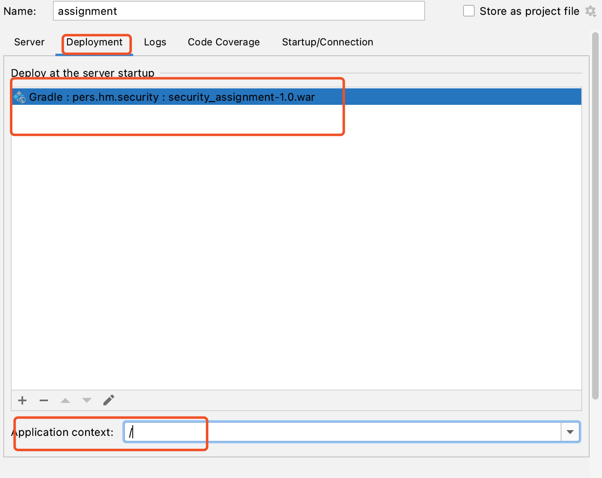

Overview
------------

A simple test of authentication and authorization service. The main features:
* Create user
* Delete user
* Create role
* Delete role
* Add role to user
* Authenticate
* Invalidate
* Check role
* All roles

Technology Stack
------------
* Java 12
* Tomcat 9.0.62
* Gradle 6.1.1
* Servlet & JSP
* json
* Groovy (Testing only)

Required Dependencies and Tools
-------------------------
* Install Java 12
* Install Tomcat 9.0.62
* Install Git 
* Install Gradle 6.1.1 
* Install IntelliJ

How To Run The Project
-------------------------
* Click Run | Edit Configurations -- to add the configuration of Tomcat 9.0.62

when configuring the deployment, select the type of 'war'

assign the application context is '/'

* Run the project. 
When the console displays the following logs, it means that the service successfully start.

When the deployment is completed, navigate to `http://localhost:8080/`. If everything is configured correctly you should see:
 

Interfaces
-------------------------
* login (related to the interface of Authenticate)
   there some test account -- Julia/123456, Ace/123456, etc.
* User (Create user, Delete user, Add role to user)

* Role (Create role, Delete role)

* Invalidate (http://localhost:8080/inValilidateToken?token=C37AE16B355AEF21E8930A31FAD6EC92)
When successfully logging the system, get the token via browser

test the interface via url, e.g., http://localhost:8080/inValilidateToken?token=C37AE16B355AEF21E8930A31FAD6EC92

* Check role (http://localhost:8080/checkRole?token=7CAA894EFCCD6E41715BEBEC8401AE83&roleName=Leader)

* All roles (http://localhost:8080/getAllRoles?token=D509384F1E7362776D8CCE39DE89477B)
